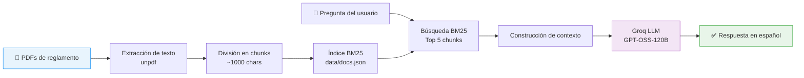

<div align="center">

# 🎓 Chatbot UCSS — Admisión


**Chatbot web de asistencia virtual para el proceso de admisión de la Universidad Católica Sedes Sapientiae (UCSS).**

Responde preguntas de postulantes basándose en la documentación oficial cargada (PDFs de reglamentos de admisión).

</div>

---

## ✨ Características

- **Chat conversacional RAG** — Responde preguntas usando solo la información de los documentos cargados
- **Carga de PDFs** — Sube reglamentos y documentos oficiales directamente desde la interfaz
- **Búsqueda BM25** — Recuperación de información eficiente sin base de datos vectorial
- **Múltiples conversaciones** — Crea, alterna y elimina conversaciones independientes
- **Exportar chat** — Descarga la conversación como archivo de texto
- **Sin base de datos** — Persistencia en `localStorage` del navegador e índice en JSON
- **Diseño responsive** — Interfaz adaptada para escritorio con tema UCSS

## 🛠️ Tecnologías

| Categoría | Tecnología |
|-----------|-----------|
| Framework | [Next.js 16](https://nextjs.org/) (App Router, Turbopack) |
| UI | [React 19](https://react.dev/) |
| Lenguaje | [TypeScript 7](https://www.typescriptlang.org/) (strict mode) |
| LLM | [Groq API](https://console.groq.com/) — `openai/gpt-oss-120b` |
| Extracción PDF | [unpdf](https://github.com/nicehash/unpdf) |
| Búsqueda | BM25 custom con stopwords en español |

## 🏗️ Arquitectura

El sistema funciona como un pipeline RAG (Retrieval-Augmented Generation):



### Flujo detallado

1. **Indexación**: Los PDFs se procesan con `unpdf`, el texto se divide en chunks y se indexa con BM25
2. **Búsqueda**: Al recibir una pregunta, se recuperan los 5 chunks más relevantes
3. **Generación**: El contexto se envía a Groq junto con el historial de la conversación
4. **Respuesta**: El LLM genera una respuesta en español basada únicamente en el contexto

## 📋 Requisitos previos

- [Node.js](https://nodejs.org/) 18 o superior
- [npm](https://www.npmjs.com/) o gestor de paquetes equivalente
- API key de [Groq](https://console.groq.com/keys) (gratis)

## 🚀 Instalación

### 1. Clonar el repositorio

```bash
git clone https://github.com/tu-usuario/chatbot-ucss.git
cd chatbot-ucss
```

### 2. Instalar dependencias

```bash
npm install
```

### 3. Configurar variables de entorno

Copia el archivo de ejemplo y configura tu API key:

```bash
cp .env.local.example .env.local
```

Edita `.env.local` y reemplaza el valor de `GROQ_API_KEY` con tu clave de API.

### 4. Iniciar el servidor de desarrollo

```bash
npm run dev
```

El chatbot estará disponible en [http://localhost:3000](http://localhost:3000).

## ⚙️ Variables de entorno

| Variable | Descripción | Requerida |
|----------|-------------|-----------|
| `GROQ_API_KEY` | API key de Groq para el modelo LLM | Sí |

> Obtén tu API key gratis en [console.groq.com/keys](https://console.groq.com/keys)

## 💡 Uso

1. **Subir documentos**: Haz clic en el ícono de documentos en la barra lateral para subir PDFs de reglamentos
2. **Iniciar conversación**: Escribe tu pregunta sobre admisión en el campo de texto
3. **Gestionar chats**: Crea nuevas conversaciones con el botón "+" en la barra lateral
4. **Exportar**: Descarga cualquier conversación como archivo `.txt`

## 📁 Estructura del proyecto

```
chatbot-ucss/
├── app/
│   ├── api/
│   │   ├── chat/route.ts       # Endpoint principal del chat (RAG)
│   │   ├── documents/route.ts  # Lista documentos indexados
│   │   ├── upload/route.ts     # Sube y procesa PDFs
│   │   └── search/route.ts     # Búsqueda BM25 independiente
│   ├── layout.tsx              # Layout raíz y metadata
│   ├── page.tsx                # Página principal
│   └── globals.css             # Estilos globales
├── components/
│   └── chat.tsx                # Componente principal del chat
├── lib/
│   ├── groq.ts                 # Cliente Groq y system prompt
│   ├── index.ts                # Gestión del índice de documentos
│   ├── ingest.ts               # Extracción y chunking de PDFs
│   ├── search.ts               # Algoritmo BM25
│   └── types.ts                # Tipos y utilidades de normalización
├── data/                       # (gitignored) Índice y PDFs procesados
├── .env.local.example          # Plantilla de variables de entorno
├── next.config.ts              # Configuración de Next.js
├── package.json                # Dependencias y scripts
└── tsconfig.json               # Configuración de TypeScript
```

## 📡 API Endpoints

| Método | Ruta | Descripción |
|--------|------|-------------|
| `POST` | `/api/chat` | Envía un mensaje y obtiene respuesta RAG |
| `POST` | `/api/upload` | Sube un PDF para indexar (máx. 25 MB) |
| `GET` | `/api/documents` | Lista los documentos indexados |
| `GET` | `/api/search?q=...` | Busca chunks relevantes (para depuración) |

## 📦 Scripts disponibles

```bash
npm run dev      # Servidor de desarrollo con Turbopack
npm run build    # Build de producción
npm run start    # Iniciar servidor de producción
npm run lint     # Verificar código (próximamente)
```

## 🤝 Contribuir

1. Haz un fork del repositorio
2. Crea una rama para tu feature (`git checkout -b feature/nueva-funcionalidad`)
3. Haz commit de tus cambios (`git commit -m 'Agregar nueva funcionalidad'`)
4. Push a la rama (`git push origin feature/nueva-funcionalidad`)
5. Abre un Pull Request

---

<div align="center">

**Universidad Católica Sedes Sapientiae** — Proyecto de asistencia virtual para admisión

</div>
